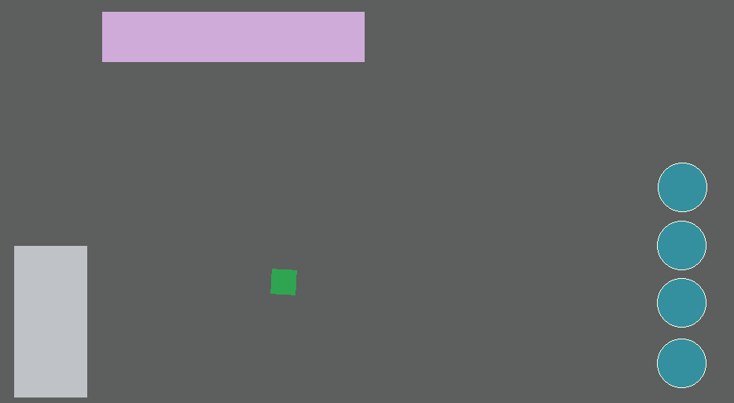

<br>
# FSM <br>
A Finite State Machine (FSM) Behavior, Used to control the flow of logic for objects <br>
<br>
Author: piranha305 <br>
Website: https://piranha305.itch.io/ <br>
Addon Url: https://www.construct.net/en/make-games/addons/1089/fsm <br>
Download Latest Version : [Version: 1.0.0.2](https://github.com/armandoalonso/fsm/releases/latest) <br>
<sub>Made using [c3ide2-framework](https://github.com/ConstructFund/c3ide2-framework) </sub><br>

## Table of Contents
- [Usage](#usage)
- [Examples Files](#examples-files)
- [Properties](#properties)
- [Actions](#actions)
- [Conditions](#conditions)
- [Expressions](#expressions)
---
## Usage
To build the addon, run the following commands:

```
npm i
node ./build.js
```

To run the dev server, run

```
npm i
node ./dev.js
```

The build uses the pluginConfig file to generate everything else.
The main files you may want to look at would be instance.js and scriptInterface.js

## Examples Files
- [piranha305_fsm_examples](./examples/piranha305_fsm_examples.c3p)
</br>
</br>

</br>

---
## Properties
| Property Name | Description | Type |
| --- | --- | --- |
| Enabled | Enable or disable the FSM | check |
| Initial State | The initial state of the FSM (does not trigger OnStateEnter) | text |


---
## Actions
| Action | Description | Params
| --- | --- | --- |
| Go to state | Transition to a specific state | State             *(string)* <br> |
| Enable | Enable or disable the FSM | Enabled             *(boolean)* <br> |


---
## Conditions
| Condition | Description | Params
| --- | --- | --- |
| On any state change | Triggered when state changes |  |
| On state enter | Triggered when a specific state is entered | State *(string)* <br> |
| On state exit | Triggered when a specific state is exited | State *(string)* <br> |
| On state transition | Triggered when a specific state transition occurs | From *(string)* <br>To *(string)* <br> |
| Current state is | Check if the current state is a specific state | State *(string)* <br> |
| Previous state is | Check if the previous state is a specific state | State *(string)* <br> |
| Is enabled | Check if the FSM is enabled |  |


---
## Expressions
| Expression | Description | Return Type | Params
| --- | --- | --- | --- |
| CurrentState | The current state | string |  | 
| PreviousState | The previous state | string |  | 
