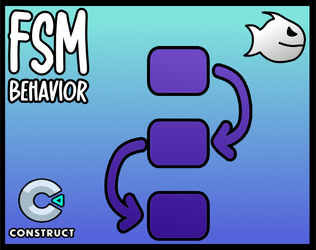

<br>
# FSM
<i>A Finite State Machine (FSM) Behavior, Used to control the flow of logic for objects</i> <br>
### Version 4.0.0.2

[](https://github.com/armandoalonso/fsm/releases/download/piranha305_fsm-4.0.0.2.c3addon/piranha305_fsm-4.0.0.2.c3addon)
<br>
<sub> [See all releases](https://github.com/armandoalonso/fsm/releases) </sub> <br>

---
<b><u>Author:</u></b> piranha305 <br>
<sub>Made using [CAW](https://marketplace.visualstudio.com/items?itemName=skymen.caw) </sub><br>

## Table of Contents
- [Usage](#usage)
- [Examples Files](#examples-files)
- [Properties](#properties)
- [Actions](#actions)
- [Conditions](#conditions)
- [Expressions](#expressions)
---
## Usage
To build the addon, run the following commands:

```
npm i
npm run build
```

To run the dev server, run

```
npm i
npm run dev
```

## Examples Files
| Images | Description | Download |
| --- | --- | --- |
|  | fsm_examples | [](https://github.com/armandoalonso/fsm/raw/refs/heads/main/examples/fsm_examples.c3p) |

---
## Properties
| Property Name | Description | Type |
| --- | --- | --- |
| Enabled | Enable or disable the FSM | check |
| Initial State | The initial state of the FSM | text |
| Trigger Initial State | Trigger the initial OnStateEnter event | check |


---
## Actions
| Action | Description | Params
| --- | --- | --- |
| Go to state | Transition to a specific state | State             *(string)* <br> |
| Set enabled | Enable or disable the FSM | Enabled             *(boolean)* <br> |


---
## Conditions
| Condition | Description | Params
| --- | --- | --- |
| Current state in list | Check if the current state is in a list of states | States *(string)* <br> |
| Current state is | Check if the current state is a specific state | State *(string)* <br> |
| Is enabled | Check if the FSM is enabled |  |
| On any state change | Triggered when state changes |  |
| On state enter | Triggered when entering a specific state | State *(string)* <br> |
| On state enter in list | Triggered when entering a state in a list of states | States *(string)* <br> |
| On state exit | Triggered when exiting a specific state | State *(string)* <br> |
| On state exit in list | Triggered when exiting a state in a list of states | States *(string)* <br> |
| On state transition | Triggered when transitioning from one state to another | From *(string)* <br>To *(string)* <br> |
| Previous state in list | Check if the previous state is in a list of states | States *(string)* <br> |
| Previous state is | Check if the previous state was a specific state | State *(string)* <br> |


---
## Expressions
| Expression | Description | Return Type | Params
| --- | --- | --- | --- |
| CurrentState | Get the current state | string |  | 
| PreviousState | Get the previous state | string |  | 
